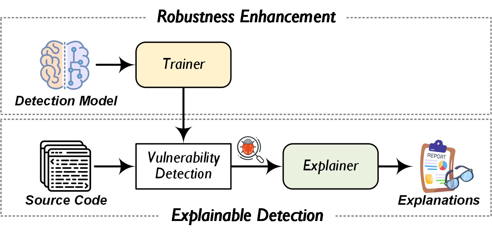
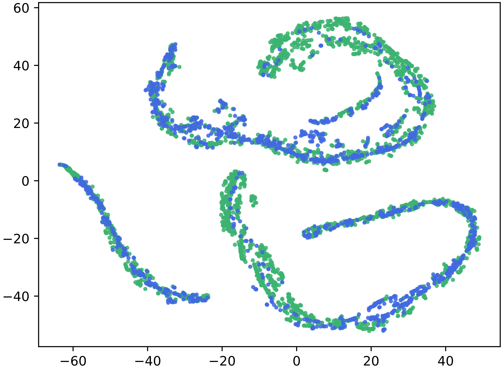

<a name="JdLRz"></a>
# Coca: Improving and Explaining Deep Learning-based Vulnerability Detection Systems
<p align="center">
  
</p>
Deep Learning (DL) models are increasingly integrated into vulnerability detection systems, and has achieved remarkable success. However, the lack of explainability poses a critical challenge to deploy black-box models in security-related domains. For this reason, several approaches have been proposed to explain the decision logic of the detection model by providing a set of crucial statements positively contributing to its predictions. Unfortunately, due to the weak robustness of DL models and failure to satisfy certain special requirements in security domains, existing explanation approaches are not directly applicable to DL-based vulnerability detection systems.

In this paper, we propose Coca, a general framework aiming to 1) enhance the robustness of existing neural vulnerability detection models to avoid spurious explanations; and 2) provide both _concise_ and _effective_ explanations to reason about the detected vulnerabilities. Coca consists of two core parts referred to as _Trainer_ and _Explainer_. The former aims to train a detection model which is robust to random perturbation based on contrastive learning, while the latter builds an explainer to derive crucial statements that are most decisive to the detected vulnerability via dual-view causal inference. We apply _Trainer_ over three types of DL-based vulnerability detectors and provide the prototype implementation of _Explainer_ for GNN-based models. Experimental results show that Coca can effectively improve existing DL-based vulnerability detection systems, and provide high-quality explanations.

<a name="ScN0I"></a>
## Prerequisites

Install the necessary dependencies before running the project:
<a name="ZRVYs"></a>
### Environment Requirements
```
torch==1.9.0
torchvision==0.10.0
pytorch-lightning==1.4.2
tqdm>=4.62.1
wandb==0.12.0
pytest>=6.2.4
wget>=3.2
split-folders==0.4.3
omegaconf==2.1.1
torchmetrics==0.5.0
joblib>=1.0.1
```
<a name="G2LdD"></a>

### Thrid Party Liraries

- [Joern](https://github.com/joernio/joern)
- [tree-sitter](https://github.com/tree-sitter/tree-sitter)

## Dataset
The Dataset we used in the paper:

Big-Vul [1]: https://drive.google.com/file/d/1-0VhnHBp9IGh90s2wCNjeCMuy70HPl8X/view?usp=sharing

Reveal [2]: https://drive.google.com/drive/folders/1KuIYgFcvWUXheDhT--cBALsfy1I4utOy

Devign [3]: https://drive.google.com/file/d/1x6hoF7G-tSYxg8AFybggypLZgMGDNHfF

CrossVul [4]: https://zenodo.org/record/4734050

CVEFixes [5]: https://zenodo.org/record/4476563

## t-SNE Visualization

**(1) DeepWuKong (Standard Cross-Entropy)**
<p align="center">
  
</p>

**(2) DeepWuKong (Supervised Contrastive Learning)**
<p align="center">
  
</p>


## Reference

[1] Jiahao Fan, Yi Li, Shaohua Wang, and Tien Nguyen. A C/C++ Code Vulnerability Dataset with Code Changes and CVE Summaries. MSR 2020.

[2] Saikat Chakraborty, Rahul Krishna, Yangruibo Ding, and Baishakhi Ray. Deep Learning based Vulnerability Detection: Are We There Yet? IEEE Transactions on Software Engineering, 2022.

[3] Yaqin Zhou, Shangqing Liu, Jingkai Siow, Xiaoning Du, and Yang Liu. Devign: Effective vulnerability identification by learning comprehensive program semantics via graph neural networks. NeurIPS 2019.

[4] Georgios Nikitopoulos, Konstantina Dritsa, Panos Louridas, and Dimitris Mitropoulos. CrossVul: A Cross-Language Vulnerability Dataset with Commit Data. ESEC/FSE 2021.

[5] Guru Bhandari, Amara Naseer, and Leon Moonen. CVEfixes: Automated Collection of Vulnerabilities and Their Fixes from Open-Source Software. PROMISE 2021.